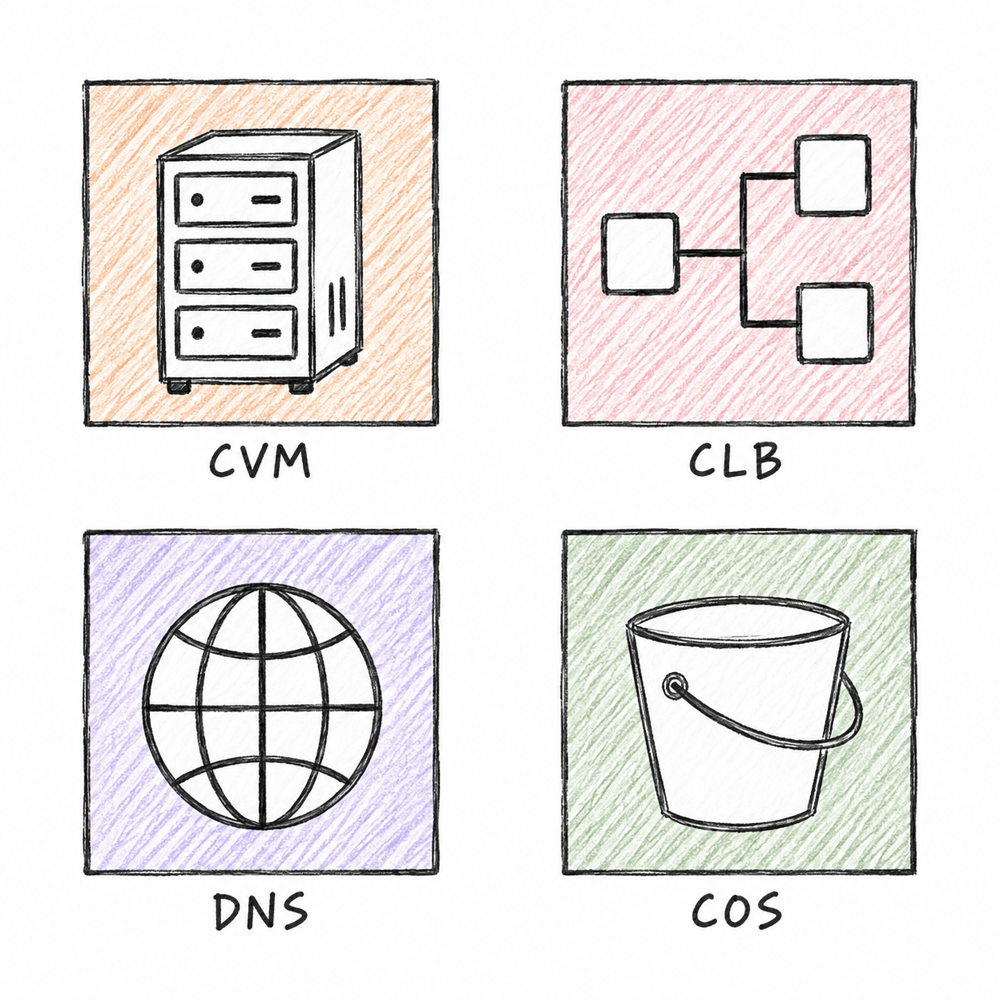
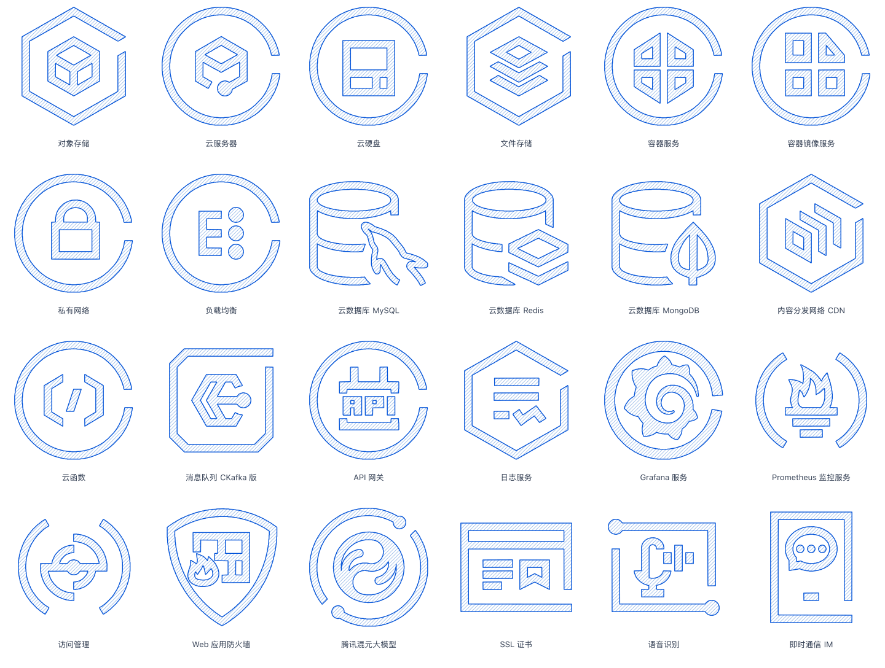

# Excalidraw Assets

可拆组、改色的 Excalidraw 手绘素材库。

## 已选画风 · 铅笔手绘基础设施

CVM、CLB、DNS、COS 四个小样采用已确认的铅笔画风：正方形边框、四色排线、白色主体与黑色复描轮廓。可编辑版保留轮廓和配色，简化了原图的纸张颗粒。

- **[一键添加到 Excalidraw](https://excalidraw.com/#addLibrary=https%3A%2F%2Fraw.githubusercontent.com%2Fexcalidraw%2Fexcalidraw-libraries%2F7c5d88a1cc3944719a8cf91a6dab37af42a2d8cf%2Flibraries%2Ftaoxiesz%2Ftencent-cloud-pencil.excalidrawlib)** · [官方图库收录申请](https://github.com/excalidraw/excalidraw-libraries/pull/2882)（待审核）
- **[下载四款可编辑素材库](./tencent-cloud/pencil-icons/output/pencil.excalidrawlib)**
- [使用说明与实际 Excalidraw 渲染](./tencent-cloud/pencil-icons/README.md)
- [可编辑对比画布](./tencent-cloud/pencil-icons/output/icon-sheet.excalidraw)

下方全量图库仍是早期版本，尚未套用这套新画风。

## 腾讯云 · 455 款

根据官方资源包绘制，覆盖 896 个中英文源文件；包含蓝色、黑白两套，共 910 个素材项，按 13 类整理。

- **[完整下载包（约 36 MB）](./tencent-cloud/output/tencent-cloud-handdrawn.zip)**
- [使用说明与分类下载](./tencent-cloud/README.md)
- [蓝色全量库](./tencent-cloud/output/all/tencent-cloud-all-blue.excalidrawlib) · [黑白全量库](./tencent-cloud/output/all/tencent-cloud-all-mono.excalidrawlib)
- [预览页源文件](./tencent-cloud/output/index.html)：下载包解压后，用浏览器打开该文件，可搜索中文名称、英文别名和 COS/CVM 等缩写。

建议按类别导入，避免一次载入整个素材库。文件结构、来源覆盖与抽样 Excalidraw 渲染已验证；全量文件导入性能尚未实测。

这是非官方手绘改编；品牌和原始图标的权利归相应权利人。制作过程、固定来源版本与验证记录见主题说明。
