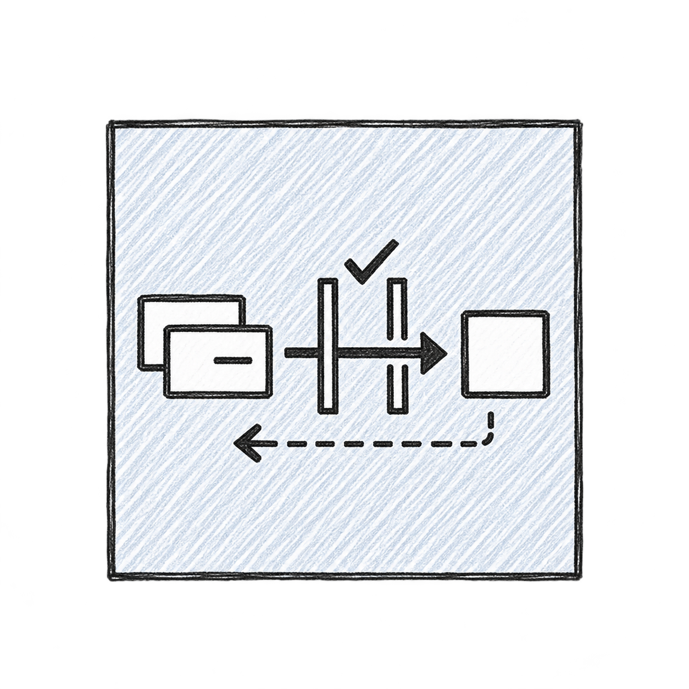

# 可复用的手绘技术图标流程

[打开交互流程图](./output/workflow.html) · [规格提取提示词](./data/brief-prompt.md) · [已认可的风格参考](./assets/style-reference.png)

把开放式设计判断收敛成小规格，再交给绘图工具，是这次可以复用的部分。普通文本模型只需提取职责、选择简单图形、填写 JSON；固定脚本负责组装一致的绘图提示词。减少对强文本模型的依赖是本方案的目标，**尚未进行较弱模型对照测试**。

## 这次实际上做了什么

1. 前期用户确认了 CVM / CLB / DNS / COS 四款生成小样的画风：方形边框、彩色铅笔排线、白色主体、简单黑色轮廓。这张已确认的图被保留为参考。
2. 读取 Change Stream 组件定义。v1 过度遵循文档中的信封、石门、工匠和小岛隐喻，生成了叙事插画。用户指出它是关键技术组件，不能这么文艺。
3. 根据纠正，将核心语义改为变更事件、审批隔离、异步回执；转成事件卡片、抽象闸口、实线箭头、目标方块和一条较细的反向虚线。
4. 手工编写有明确对象清单与禁止项的提示词，将已认可的四款小样作为 **style-only** 参考图传给内置 `image_gen`。v2 使用的是四款图标参考，不是直接再次调用 D096 作者原图。
5. 绘图工具生成像素图，保存 PNG 和实际提示词。**v2 已生成，用户尚未确认它的最终质量；它也还没有被转成可编辑 Excalidraw 图标。**

[v2 实际提示词](./data/actual-v2-prompt.txt) 保留原文；下方模板是基于这次经验新增的复用方案，不能称为当时已经执行过的脚本。



## 哪些工作交给谁

| 工作 | 执行者 | 如何降低难度 |
|---|---|---|
| 理解组件 | 普通文本模型 | 提取一句职责、最多三个关键语义 |
| 选择图形 | 普通文本模型 | 用固定词表，限制四个主体与一个辅助元素 |
| 保持风格 | 固定参考图 + 固定模板 | 不让每次执行重新选画风 |
| 组装提示词 | Python 标准库脚本 | 内容字段与风格规则分开 |
| 绘制像素 | 图像生成工具 | 保持同一工具和参考图再比较文本模型 |
| 检查方向与简洁度 | 用户或支持看图的模型 | 对照明确检查项，不凭“感觉不错” |
| 原生编辑与导入 | 后续 Excalidraw 重绘步骤 | 单独核对几何、分组、字体与导入结果 |

Astra 这类文本代理负责理解和调用工具，本次实际画面由独立的图像生成工具输出。换文本模型不等于换绘图模型。当前工具没有向本流程提供可固定的内部绘图模型版本或随机种子，因此不能承诺逐像素复现，也不能推断任意廉价图像模型会有相同效果。

## 最短复用方法

把这个目录、你的新组件定义一起交给一个能够调用图像工具的代理，使用下面这一段任务指令即可：

> 按 data/brief-prompt.md 提取组件规格，参考 data/change-stream.example.json 的结构。保留我的最新要求，别把文档比喻画成故事。运行 scripts/compile_prompt.py 生成提示词，然后实际调用图像工具，附上 assets/style-reference.png 作为画风参考，生成一个 PNG 小样。检查核心语义、方向、简洁度与画风。发现问题只改对应项，保持参考图不变。保存图片、规格与最终提示词，展示结果。不要只回复方案；不要自动上传我司组件到公共图库。

编译脚本的实际用法（本目录内执行，示例已运行）：

```bash
python3 scripts/compile_prompt.py data/change-stream.example.json --out output/change-stream.prompt.txt
```

若使用普通图片对话界面，直接附上风格参考 PNG，粘贴编译后的提示词即可。不能接收参考图的纯文本环境无法独立完成这套画风复用。

## 图像检查与小范围纠偏

- 语义：是否能看出最多三个关键概念？不要求小图交代完整架构。
- 正确性：传递方向、审批位置、异步回执是否与组件定义一致？是否误画直接调用或绕过闸口？
- 简洁度：在 64–96 px 下是否还能辨认主体？太密就删次要图形，不加解释文字。
- 风格：是否保留方框、浅色排线、白色主体、自然黑色复描？参考图有没有把原本的服务器或水桶带入新图？
- 边界：PNG 不是可编辑素材库；用户要求 Excalidraw 时应再完成原生重绘并实际导入验证。

纠偏句式：**“保持所有已确认部分不变，只把【失败项】改为【明确图形规则】。”** 例如：“保持构图和画风，只把完整封闭的闸条改成有开口的隔离边界，使主箭头确实穿过开口。”

最多做两轮聚焦修正；仍然失败时先简化语义规格，避免只增加更多否定词。这个次数是复用流程的建议，不是图像工具保证。

## 如何验证普通模型是否足够

先固定图像工具、参考 PNG、编译脚本，只替换“规格提取”所用的文本模型。用已有四款资源和一个未见组件做小样，记录：语义是否正确、是否需要人纠正、绘图调用次数以及工具实际报告的费用/用时。没有费用记录就不要估算。至少覆盖一次边界或异步关系，避免只测试简单服务器外形。

若生成质量不好，先区分问题出在规格还是画风：规格错就调整词表或换更强的文本模型；规格对而笔触不一致，则检查参考图和图像工具。没有这组对照实验前，不把“低成本等效”当成已验证结论。

## 工具的角色与复现文件

- `handdraw-style-prompter`：前期用于选 D096 的风格参考。固定了认可的小样后，普通复用无需每次重新选风格。
- 内置 `image_gen`：两轮 Change Stream PNG 的实际生成工具。
- `archify`：仅用于本次流程说明 HTML，不参与 icon 像素生成。
- Excalidraw 重绘：之前四款基础设施图标走过；Change Stream v2 尚未走过。
- `data/workflow.json`：流程图规范；`data/delivery-receipt.json`：HTML 交付哈希与校验回执。
- `data/change-stream.example.json`：可复制的规格；`scripts/compile_prompt.py`：不联网、无模型依赖的提示词编译器。

本复用流程已按用户要求整理入仓库，并抽取为独立的 [handdraw-tech-icons skill](../skills/handdraw-tech-icons/SKILL.md)。原始组件定义没有纳入本次上传；图标也没有新增到官方公共图库。后续复用以独立 skill 为准，本目录保留流程记录与抽取时的编译示例。
