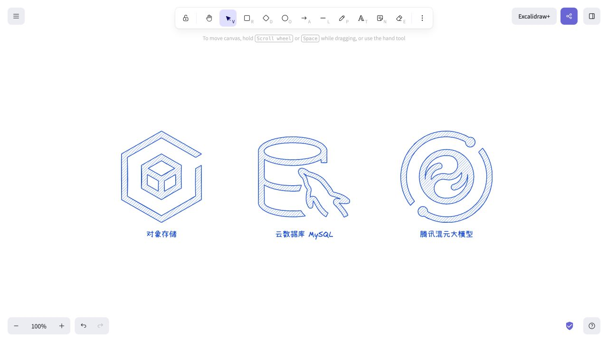

# 腾讯云 Excalidraw 手绘素材库

基于腾讯云官方 SVG 资源包制作的非官方手绘改编。**455 个独立图标条目，蓝色和黑白两套，共 910 个素材项，分 13 类**。每个图标都由 Excalidraw 原生线条与文字组成，可拆组编辑，不含嵌入图片。

## 下载与使用

- [可搜索预览页](./output/index.html)：支持中文名称、英文别名、COS/CVM 等常用缩写。点击卡片下载单个蓝色图标。
- [完整下载包](./output/tencent-cloud-handdrawn.zip)
- [蓝色全量素材库](./output/all/tencent-cloud-all-blue.excalidrawlib)
- [黑白全量素材库](./output/all/tencent-cloud-all-mono.excalidrawlib)

在 Excalidraw 右上角打开素材库，菜单中选择 Open 导入 `.excalidrawlib`。全量库每套约 42 MiB；日常使用推荐导入需要的分类包。图标与产品名称已分组，取消分组后可修改线条、颜色及名称。

## 分类包

| 类别 | 条目 | 蓝色 | 黑白 |
|---|---:|---|---|

| AI与智能 | 51 | [下载](./output/all/libraries/ai-intelligence-blue.excalidrawlib) | [下载](./output/all/libraries/ai-intelligence-mono.excalidrawlib) |

| 大数据 | 16 | [下载](./output/all/libraries/big-data-blue.excalidrawlib) | [下载](./output/all/libraries/big-data-mono.excalidrawlib) |

| 计算与容器 | 37 | [下载](./output/all/libraries/compute-container-blue.excalidrawlib) | [下载](./output/all/libraries/compute-container-mono.excalidrawlib) |

| 数据库 | 30 | [下载](./output/all/libraries/database-blue.excalidrawlib) | [下载](./output/all/libraries/database-mono.excalidrawlib) |

| 开发与运维 | 56 | [下载](./output/all/libraries/devops-blue.excalidrawlib) | [下载](./output/all/libraries/devops-mono.excalidrawlib) |

| 企业应用 | 44 | [下载](./output/all/libraries/enterprise-apps-blue.excalidrawlib) | [下载](./output/all/libraries/enterprise-apps-mono.excalidrawlib) |

| 行业与物联网 | 22 | [下载](./output/all/libraries/industry-iot-blue.excalidrawlib) | [下载](./output/all/libraries/industry-iot-mono.excalidrawlib) |

| 音视频 | 30 | [下载](./output/all/libraries/media-blue.excalidrawlib) | [下载](./output/all/libraries/media-mono.excalidrawlib) |

| 中间件 | 24 | [下载](./output/all/libraries/middleware-blue.excalidrawlib) | [下载](./output/all/libraries/middleware-mono.excalidrawlib) |

| 网络与CDN | 29 | [下载](./output/all/libraries/network-cdn-blue.excalidrawlib) | [下载](./output/all/libraries/network-cdn-mono.excalidrawlib) |

| 其他 | 24 | [下载](./output/all/libraries/other-blue.excalidrawlib) | [下载](./output/all/libraries/other-mono.excalidrawlib) |

| 安全 | 79 | [下载](./output/all/libraries/security-blue.excalidrawlib) | [下载](./output/all/libraries/security-mono.excalidrawlib) |

| 存储 | 13 | [下载](./output/all/libraries/storage-blue.excalidrawlib) | [下载](./output/all/libraries/storage-mono.excalidrawlib) |

## 覆盖范围

官方压缩包包含 896 个 SVG：中文 455 个、英文 441 个。455 个中文文件全部各自保留为独立条目，包括 31 个带数字后缀的官方变体；英文同图形来源对应到中文条目并保留别名，没有漏掉来源。455 是素材条目数，不代表 455 个互不重复的在售产品。本次“全部”指下面固定版本官方资源包，不承诺覆盖资源包发布后新增的产品。分类用于浏览检索，不是官方产品分类。

## 验证

- 896/896 源 SVG 成功渲染，失败 0，空白 0。
- 455/455 图标均经过轮廓还原检查；相对源墨迹蒙版的最低 IoU 为 0.95298，门槛为 0.95。此数值验证几何保留情况，不衡量手绘美观程度。
- 蓝色、黑白全量库各 455 条，原生元素合计 137,654 个，无位图元素。
- COS、MySQL、混元样例的 464 个原生元素已通过剪贴板导入官方 Excalidraw 网页版并检查实际渲染。
- 图库搜索和分类筛选已浏览器检查；全部本地文件链接已检查。
- 浏览器文件选择器未响应，localhost 素材库安装 URL 被官方页面拒绝，因此全量 `.excalidrawlib` 文件导入与运行性能尚未实测。

## 文件与重建

- `output/all/icons/`：455 个独立蓝色 `.excalidraw`。
- `output/all/libraries/`：13 类 × 2 色，共 26 个分类素材库。
- `output/all/boards/`：每页至多 24 个图标的可编辑分类预览画布。
- `assets/all/`：455 张 SVG 轮廓预览；手绘抖动由 Excalidraw 实际渲染。
- `data/source-catalog.json`：896 个来源到455条目的完整映射。
- `data/build-report.json`：每项的几何、数量和来源记录。
- `data/official-icons.zip`：本次官方原始素材包。

在主题目录执行 `python3 scripts/build.py` 可以从随附的官方 zip 重建素材。需要已有的 Python numpy、Pillow、contourpy 和 Node sharp；本次使用本机预装版本，没有新增项目依赖。sharp 支持通过 `SHARP_MODULE_PATH` 指向现有安装。`node scripts/preview.cjs` 生成 24 图预览。

转换先通过 SVG 渲染正确处理裁剪、掩膜和白色留白，再提取简化轮廓和裁剪后的排线，最终输出全部为原生线条。渐变和多色细节统一为单色手绘风格。上轮 COS/CVM 四款简化手绘样稿仍保留在 `output/` 根目录。

## 来源与权利

- [腾讯云官方架构图素材库](https://cloud.tencent.com/act/event/icons)
- [使用的官方 SVG 资源包](https://dscache.tencent-cloud.cn/upload/uploader/tencent_cloud_product_icons_svg-cabb63b49a754a7417b973bec8724623f0414854.zip)
- [Excalidraw 社区图库：风格参考](https://libraries.excalidraw.com/)

腾讯云名称与原始产品标志权利归相应权利人。本目录是非官方手绘改编，不将品牌素材重新声明为 MIT 等开源授权。资源仓库：[TaoXieSZ/excalidraw-assets](https://github.com/TaoXieSZ/excalidraw-assets)。
