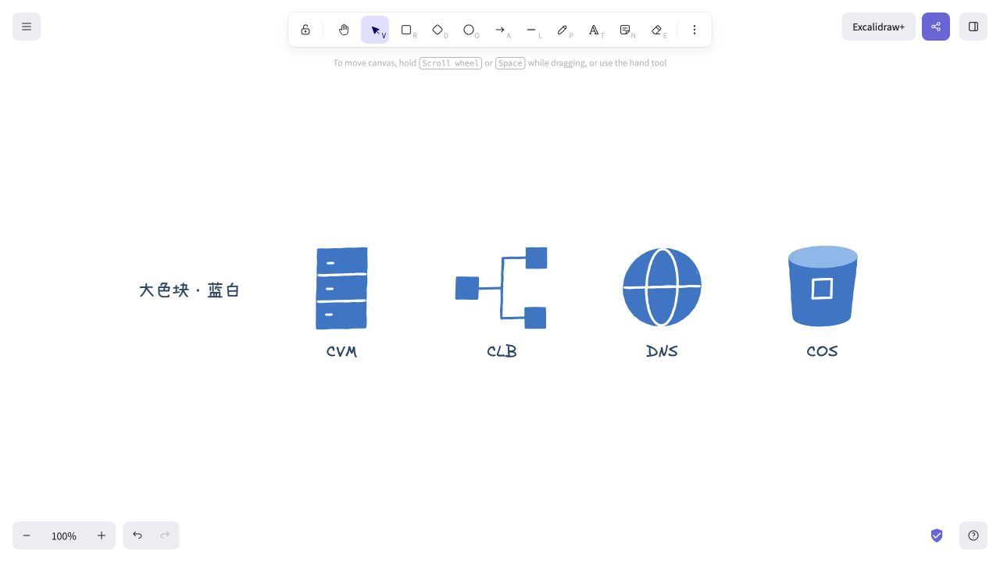

# 基础架构大色块小样

根据“大色块、线条简单”的偏好，仅制作 CVM、CLB、DNS、COS 四个蓝白小样，等待用户满意后再扩展其他资源。

[预览页面](./output/index.html) · [四项素材库](./output/single.excalidrawlib) · [可编辑画布](./output/comparison.excalidraw)

大面积蓝色填充构成主体，少量白线表达结构；无排线和装饰复笔。素材为资源语义的简笔表达，并非官方 Logo。所有色块与细节为可拆组编辑的 Excalidraw 原生元素。

`scripts/build.py` 使用 Python 标准库重建本目录；不修改先前的小样和全量图库。已检查四项素材的 ID、有限坐标、原生元素类型、10 个预览和下载链接，并在 Excalidraw 中检查全部四个图标的填充与白色细节。
