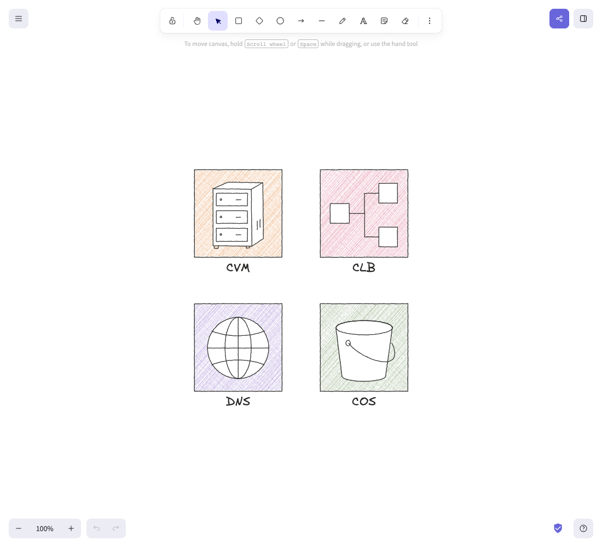

# Pencil infrastructure icons

Four editable architecture symbols: **CVM, CLB, DNS, COS**. The raster sketch below was approved as the visual direction on 2026-09-22. The native files are a vector adaptation for review, not a pixel-identical conversion.

[Install in Excalidraw](https://excalidraw.com/#addLibrary=https%3A%2F%2Fraw.githubusercontent.com%2Fexcalidraw%2Fexcalidraw-libraries%2F7c5d88a1cc3944719a8cf91a6dab37af42a2d8cf%2Flibraries%2Ftaoxiesz%2Ftencent-cloud-pencil.excalidrawlib) · [Download library](./output/pencil.excalidrawlib) · [Editable sheet](./output/icon-sheet.excalidraw) · [Preview page](./output/index.html)

Import the `.excalidrawlib` through Excalidraw's library menu. Each icon is grouped for placement; ungroup to edit its hatching, outlines and label. Individual `.excalidraw` files are also available in `output/`.

## Public library submission

[Upstream review #2882](https://github.com/excalidraw/excalidraw-libraries/pull/2882) is pending. The installation link above works before catalog approval and is pinned to the submitted revision. It uses the official repository URL exposed by the pull request: Excalidraw blocks URL imports from personal forks. The corrected link was tested through the import confirmation and the four rendered items in the library sidebar. The published package has English expanded item names, native grouping and a preview rendered in Excalidraw. The upstream validation script passes locally; upstream preview deployment requires maintainer authorization.

## Approved visual reference

The reference was generated with the D096 example from [handraw-style](https://github.com/yang0/handraw-style), revision `161efafdce982b16287f589dbf18fcf5b4f021c9`, supplied as a style-only reference. Its subject matter was not copied. The original generated PNG is preserved without modification.

## Editable adaptation

- 160 × 160 square base geometry; subtle graphite strands may vary by 0.3 px.
- Orange CVM server, pink CLB branching nodes, lavender DNS globe, green COS bucket.
- Simple black contours, white interior silhouettes, dominant diagonal shading and a lighter cross pass.
- Close overlapping strokes approximate pencil texture. Raster paper grain is intentionally simplified; this is not an embedded image or an exact texture reconstruction.
- Native line and text elements only; English labels use Excalifont. The lightweight SVG preview may use the browser's fallback handwriting font.
- Category colors are design choices, not official Tencent Cloud color specifications. Symbols are generic infrastructure pictograms rather than official product logos.
- This set covers only the four approved subjects. The earlier 455-item catalog has not been restyled.

## Rebuild and validation

Run `python3 tencent-cloud/pencil-icons/scripts/build.py` from the repository root. It uses Python's standard library. The build checks unique IDs, finite geometry, square bases, grouping, four library items, native element types, label fonts, English page text and 11 local links. Results are saved in `data/validation.json`.

`scripts/render.cjs` loads the sheet in a fresh, isolated browser context on the live Excalidraw editor, checks native selection and saves `assets/native-sheet.png`. It uses the existing Codex runtime's Playwright and installed Google Chrome; no project dependency is installed. The four-icon sheet has 778 native elements, primarily fine hatching. Large diagrams containing many copies have not been performance-tested.

The line geometry is shared between the HTML/SVG preview and native files. Rebuild the native screenshot after changing geometry. Export structures follow the [Excalidraw export examples](https://github.com/excalidraw/excalidraw/blob/master/packages/utils/README.md).
