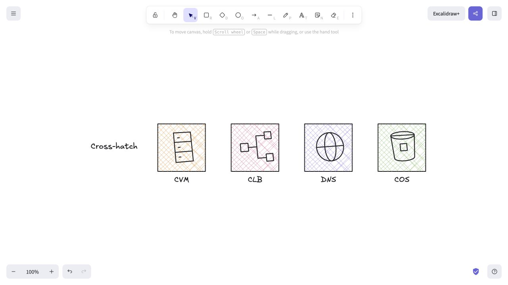
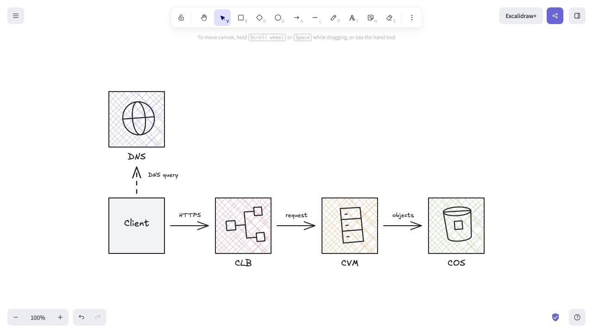

# Hand-drawn square infrastructure icons

Four resources only: CVM, CLB, DNS and COS. Cross-hatching is the selected direction; expansion awaits visual approval.

[Preview](./output/index.html) · [Cross-hatch library](./output/cross.excalidrawlib) · [Editable icon sheet](./output/comparison.excalidraw) · [Architecture example](./output/architecture.excalidraw)

- Consistent 120 × 120 square frames, with English labels outside.
- Light colored cross-hatching, straight black edges and simple symbols.
- Frames are exact 120 × 120 squares with four right angles. Inner symbols use straight edges with slightly skewed angles and asymmetric proportions. Native roughness is zero to prevent artificial bending. Natural curved features remain curved.
- Editable line and text elements. Each hatch stroke has exactly two endpoints, with small variations in spacing and angle. No embedded images.
- Category colors are visual choices for this study, not official Tencent Cloud specifications.
- The alternate solid-fill files are retained, but the preview and architecture use cross-hatching.

## Rebuild and validation

Run `python3 tencent-cloud/square-study/scripts/build.py`. The script uses only Python's standard library and does not change earlier studies or the full catalog.

Checks cover square dimensions, unique item element IDs, finite geometry, English-only HTML and exported Excalidraw files, and all 12 preview/download links. The four cross-hatched icons and architecture example were rendered in Excalidraw. SVG previews use exactly the same line coordinates, fill colors and opacity as native elements. Checks also enforce exact square frame vertices, two endpoints per hatch stroke and zero native roughness.
