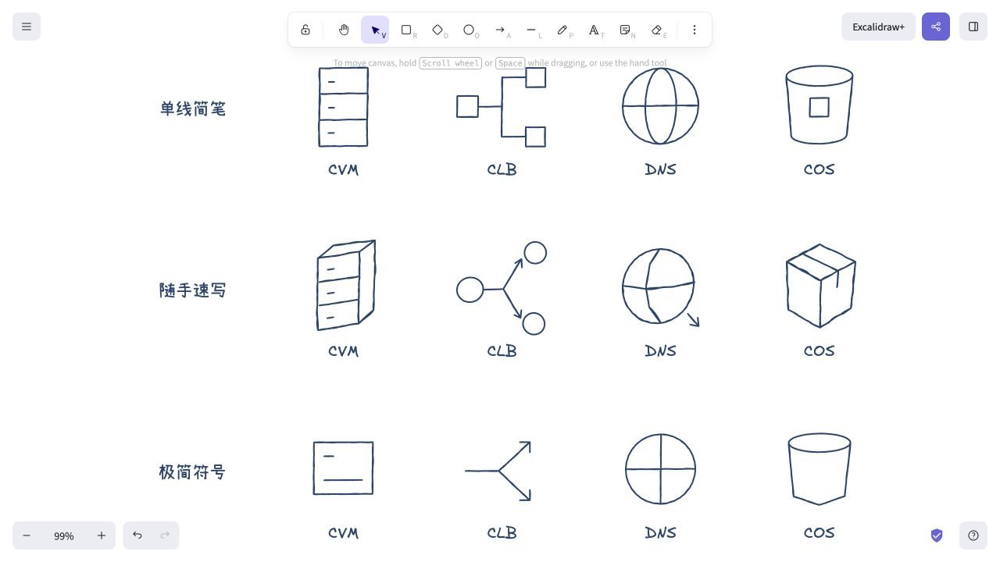

# 基础架构简笔风格小样

仅试画 CVM、CLB、DNS、COS，等待风格确认后再扩展。已有全量图库保持原样。

- **单线简笔**：少量轮廓和物体特征，推荐起点。
- **随手速写**：略歪的轮廓、简单透视，可按资源混搭。
- **极简符号**：尽量少的识别线条，适合密集架构图。

[打开对比页](./output/index.html) · [可编辑对比画布](./output/comparison.excalidraw)

这里是资源语义的原创简笔表达，不是腾讯云官方 Logo 的描摹。每个小样含 2–8 个主体线条元素和一个英文标签，无排线、无填充、无人工叠加复笔。可以拆组、改色、修改线条。DNS 以地球符号配合文字标识，需要保留标签以区别于普通公网节点。

## 文件与重建

- `scripts/build.py`：仅使用 Python 标准库生成三组小样和页面，不影响全量构建。
- `assets/`：12 个 SVG 预览及原生渲染截图。
- `output/`：12 个独立画布、3 个四项素材库、对比画布及 HTML 页面。

运行 `python3 tencent-cloud/style-study/scripts/build.py` 可重建。已检查 12 个条目、元素 ID 唯一性、有限坐标、透明背景与原生元素类型；12 个小样全部在官方 Excalidraw 画布实际渲染。网页显示单线几何预览，原生渲染带 Excalidraw 笔触。
